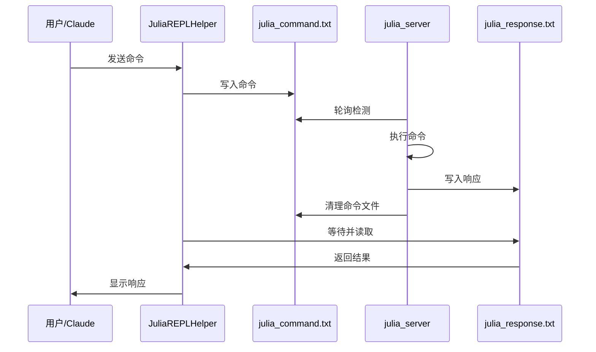

# 🚀 Julia REPL Server Skill

[](https://julialang.org/)
[](LICENSE)

一个高效的 Julia REPL 服务器技能，提供零编译时间的交互式 Julia 开发体验。该技能可作为 Claude Code 扩展使用。

## ✨ 核心特性

- 🔄 **零编译时间** - Julia REPL 持续运行，无需每次重新启动
- 🔥 **热重载支持** - Revise.jl 自动检测代码变化并重载
- 🛡️ **稳健错误处理** - 错误不会中断会话，可立即重试
- 📦 **完整科学计算环境** - 预加载 ITensors, Plots, DataFrames 等包
- 💾 **文件通信机制** - 通过文本文件进行进程间通信
- 🎯 **简单易用的 API** - 一个函数即可发送任何 Julia 代码
- 🧹 **极简设计** - 移除冗余功能，专注核心通信

## 📋 系统要求

- Julia 1.11 或更高版本
- 支持的操作系统：Windows, macOS, Linux

## 🏗️ 系统架构

```
┌─────────────────────────────────────────────────────────────────┐
│                        Julia REPL 服务器                          │
│                        ┌─────────────────┐                      │
│                        │   julia_server  │                      │
│                        │       .jl       │                      │
│                        └─────────────────┘                      │
│                                   │                             │
│                    ┌──────────────┴──────────────┐              │
│                    │     持续运行的主进程          │              │
│                    │  • 预加载所有包               │              │
│                    │  • Revise.jl 热重载          │              │
│                    │  • 监听命令文件               │              │
│                    │  • 执行 Julia 代码           │              │
│                    │  • 错误处理和响应             │              │
│                    └─────────────────────────────┘              │
│                                   │                             │
│                    ┌──────────────┴──────────────┐              │
│                    │       通信机制              │              │
│                    │  • julia_command.txt        │              │
│                    │  • julia_response.txt       │              │
│                    │  • 文件轮询 (0.5秒)          │              │
│                    │  • 自动清理临时文件          │              │
│                    └─────────────────────────────┘              │
└─────────────────────────────────────────────────────────────────┘
                                   ▲
                                   │
┌─────────────────────────────────────────────────────────────────┐
│                    Claude Code / 用户终端                        │
│                        ┌─────────────────┐                      │
│                        │ JuliaREPLHelper │                      │
│                        │       .jl       │                      │
│                        └─────────────────┘                      │
│                                   │                             │
│                    ┌──────────────┴──────────────┐              │
│                    │      客户端 API             │              │
│                    │  • send_command()           │              │
│                    │  • check_response()         │              │
│                    │  • 超时处理 (10秒)          │              │
│                    └─────────────────────────────┘              │
│                                   │                             │
│                    ┌──────────────┴──────────────┐              │
│                    │      用户交互               │              │
│                    │  • Julia 代码执行           │              │
│                    │  • 文件包含                 │              │
│                    │  • 函数调用                 │              │
│                    │  • 结果查看                 │              │
│                    └─────────────────────────────┘              │
└─────────────────────────────────────────────────────────────────┘
```

### 🔄 工作流程



## 🚀 快速开始

### 1. 安装依赖

确保安装了必要的 Julia 包：

```julia
import Pkg; Pkg.add(["Revise", "Plots", "DataFrames", "CSV", "FFTW", "ITensors", "BenchmarkTools"])
```

### 2. 启动服务器

```bash
julia --project=. scripts/julia_server.jl
```

服务器启动后会显示：
```
🤖 Julia 服务器已启动
📦 所有包已加载
🔄 Revise 热重载已激活
🎯 服务器准备就绪，等待命令...
```

### 3. 开始使用

在新的 Julia 会话中：

```julia
# 加载助手模块
include("scripts/JuliaREPLHelper.jl")
using .JuliaREPLHelper

# 执行任意 Julia 代码
response = send_command("2 + 2")
# 返回: "✅ 执行成功: 4"

# 加载包
send_command("using DataFrames, Plots")

# 创建数据
send_command("df = DataFrame(A=1:5, B=rand(5))")

# 绘制图表
send_command("plot(1:10, rand(10))")
```

## 📦 预加载包

服务器自动预加载以下包：

- **DataFrames** - 数据操作和分析
- **CSV** - CSV 文件处理
- **Plots** - 数据可视化
- **ITensors** - 张量计算
- **FFTW** - 快速傅里叶变换
- **BenchmarkTools** - 性能基准测试
- **Revise** - 热重载支持

## 🔧 核心组件

### julia_server.jl - 持久 REPL 服务器

- **功能**: 后台运行的 Julia REPL 进程
- **特点**: 预加载包、热重载、错误处理、文件通信
- **通信**: 监听 `julia_command.txt`，响应到 `julia_response.txt`

### JuliaREPLHelper.jl - 客户端通信模块

- **功能**: 与服务器通信的客户端接口
- **核心函数**:
  - `send_command(command, timeout=10)` - 发送命令并等待响应
  - `check_response()` - 检查待处理响应
- **特点**: 自动文件管理、超时处理、错误检测

## 📁 技能结构

```
julia-repl-server/
├── SKILL.md              # 技能使用文档
├── README.md             # 架构说明 (本文件)
└── scripts/
    ├── julia_server.jl   # 服务器主程序
    └── JuliaREPLHelper.jl # 客户端通信模块
```

## 💡 使用示例

### 科学计算工作流

```julia
# 加载科学计算包
send_command("using FFTW, Plots")

# 生成测试信号
send_command("t = 0:0.001:1-0.001")
send_command("signal = sin.(2π*5*t) + 0.5*sin.(2π*15*t)")

# 执行 FFT
send_command("spectrum = fft(signal)")

# 可视化结果
send_command("plot(abs.(spectrum)[1:500])")
```

### 数据分析工作流

```julia
# 处理数据
send_command("using CSV, DataFrames")
send_command("df = CSV.read(\"data.csv\", DataFrame)")

# 数据分析
send_command("describe(df)")
send_command("plot(df.column1, df.column2)")
```

### 性能测试工作流

```julia
# 性能基准测试
send_command("using BenchmarkTools")
send_command("@btime sum(rand(1000))")
send_command("@benchmark rand(1000, 1000)")
```

## 🛡️ 错误处理

- 错误不会中断服务器运行
- 详细的错误信息格式化返回
- 可立即重试修正后的代码

示例：
```
❌ 错误: UndefVarError(:undefined_function, 0x0000000000009823, Main)
```

## 🔄 热重载工作流

1. 编写或修改 Julia 代码文件
2. 使用 `send_command("include(\"your_file.jl\")")` 加载
3. 修改代码后直接重新 include，无需重启服务器

## 🎯 最佳实践

1. 保持服务器在整个开发会话中运行
2. 使用 `send_command()` 执行所有 Julia 代码
3. 检查响应格式判断成功（"✅"）或失败（"❌"）
4. 先加载需要的包：`send_command("using PackageName")`
5. 利用热重载进行迭代开发

## 📄 许可证

MIT License - 详见 [LICENSE](LICENSE) 文件

---

这个技能提供了一个完整的零编译时间 Julia 开发环境，特别适合科学计算、数据分析和交互式开发工作流。
